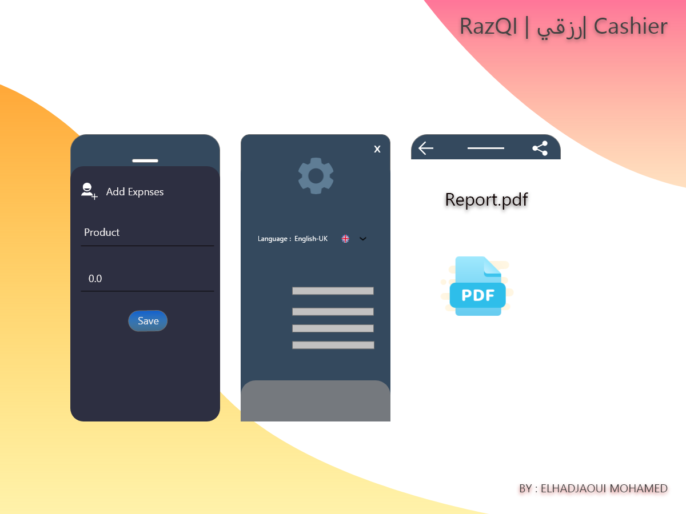

# Flutter CashierApp
Minimal UI | Modern Theme | Full Functional

Cashier is a sales, warehouse and accounting software for managing store and store accounts

 If you own a shop or store of your own and want to control accounts in it and know the daily, monthly and annual sales of the shop and the profits it achieves

Download my app on play store : [CashierApp](https://play.google.com/store/apps/details?id=com.cashier.qayadapp)

  

  

  

## Getting Started

This project is a starting point for a Flutter application.

A few resources to get you started if this is your first Flutter project:

- [Lab: Write your first Flutter app](https://flutter.dev/docs/get-started/codelab)
- [Cookbook: Useful Flutter samples](https://flutter.dev/docs/cookbook)

For help getting started with Flutter, view our
[online documentation](https://flutter.dev/docs), which offers tutorials,
samples, guidance on mobile development, and a full API reference.
